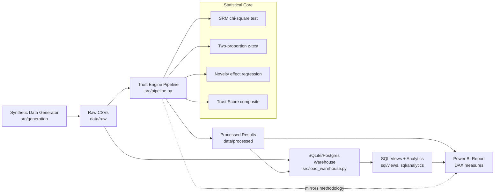

# Experiment Trust Engine

**Can we actually trust this A/B test result?** Most experimentation
dashboards assume the answer is yes and just report significance. This
project builds the layer that checks first — combining Sample Ratio
Mismatch detection, metric-definition governance, novelty-effect
detection, and guardrail monitoring into a single composite **Trust
Score** per experiment.

It's the analytics-engineering + BI half of a two-project portfolio: the
statistical/governance layer here is Python + SQL + Power BI/DAX; a
companion [e-commerce data pipeline](../ecommerce-data-pipeline) covers
the upstream data engineering side.

## Why this exists

Five real problems experimentation teams hit at scale, bundled into one
project instead of five separate toy demos:

1. **Sample Ratio Mismatch** — a broken bucketer silently invalidates a result
2. **Metric definition drift** — "active user" means something different
   halfway through an experiment (or across teams)
3. **Novelty effects** — a real lift that's decaying, not stable
4. **Guardrail regressions** — a "winning" variant that quietly breaks
   something else
5. **Underpowered tests** — a "significant" result with too small a sample
   to actually trust

## Architecture



The key design decision: **the same statistical logic exists in three
places** (Python, SQL, DAX) and is documented to match exactly, so the
Power BI report a stakeholder sees always agrees with the auditable
Python/SQL underneath it. See `dax/measures.md` for the mapping.

## Quickstart

```bash
pip install -r requirements.txt

python src/generation/generate_data.py   # synthetic experiment data (8 experiments, 200k users)
python src/pipeline.py                   # runs SRM, z-test, novelty, trust score
python src/load_warehouse.py             # loads everything into SQLite for SQL validation
```

Run the analytics SQL directly:
```bash
sqlite3 data/warehouse.db < sql/analytics/trust_analytics.sql
```

Run tests:
```bash
pip install -r requirements-dev.txt
pytest tests/ -v
```

## Results on the synthetic dataset

8 experiments were generated with deliberately varied issues. The engine
correctly separates clean wins from results that look significant but
shouldn't be trusted:

| Experiment | Issue injected | Trust Score | Verdict |
|---|---|---|---|
| checkout_button_color | none | 100.0 | TRUST |
| onboarding_flow_v2 | SRM (56/44 split) | 70.0 | TRUST WITH CAVEATS |
| recommendation_ranker_v3 | novelty decay | 80.0 | TRUST WITH CAVEATS |
| notification_frequency_increase | guardrail regression | 80.0 | TRUST WITH CAVEATS |
| active_user_definition_change_test | metric definition change | 93.9 | TRUST |
| pricing_page_redesign | none (small sample) | 100.0 | TRUST |
| search_autocomplete_v2 | none (flat/no effect) | 100.0 | TRUST |
| signup_form_shortening | SRM + novelty + guardrail | 50.0 | **DO NOT TRUST** |

`signup_form_shortening` would likely be reported as a clean win by a
dashboard that only checks p-values — the Trust Score catches all three
underlying problems at once.

## Project structure

```
experiment-trust-engine/
├── src/
│   ├── generation/generate_data.py   # synthetic data with injected issues
│   ├── stats/trust_engine.py         # SRM, z-test, novelty, trust score (pure functions)
│   ├── pipeline.py                   # runs stats engine over every experiment
│   └── load_warehouse.py             # loads CSVs into SQLite/Postgres
├── sql/
│   ├── ddl/schema.sql                # warehouse schema
│   ├── views/analysis_views.sql      # allocation, conversion, divergence views
│   └── analytics/trust_analytics.sql # window functions, leaderboards, audit queries
├── dax/measures.md                   # full DAX measure library for Power BI
├── docs/
│   ├── trust_score_methodology.md    # weighting rationale, limitations
│   └── metric_lineage.md             # governance documentation
├── powerbi/BUILD_INSTRUCTIONS.md     # how to assemble the .pbix locally
├── tests/test_trust_engine.py        # unit tests on the statistical core
└── .github/workflows/ci.yml          # runs the full pipeline + tests on every push
```

## Extending this project

- Swap the synthetic generator for a real experimentation platform export
  (Optimizely, Statsig, or an internal event stream)
- Add multiple-comparison correction (Bonferroni/BH) for the guardrail
  check when monitoring more than one guardrail metric
- Replace the linear novelty-effect regression with a proper time-series
  method (e.g., a simple Bayesian state-space model)
- Wire the SQL views into a real Postgres warehouse and schedule the
  pipeline with Airflow (see the companion e-commerce pipeline for the
  orchestration pattern)

## License

MIT — see [LICENSE](LICENSE).
